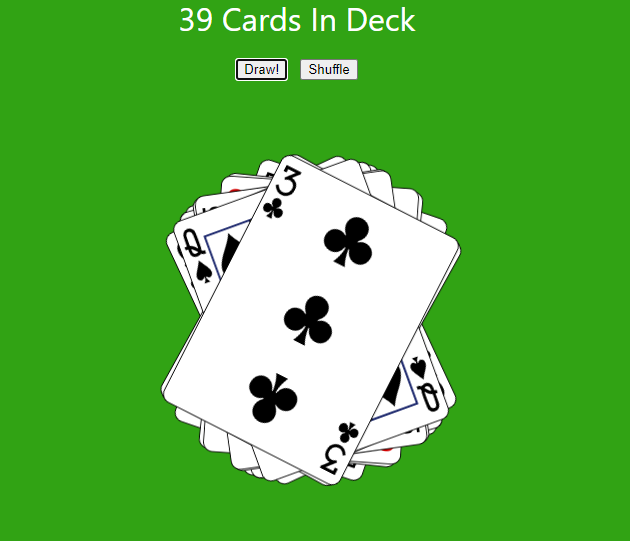

# React - Effects & Refs Exercise - "Click to Draw"
xyz

  

## Running the App
1) Clone repo: `git clone https://github.com/mpike91/React-Effects-Refs-Exercise.git`
2) Move into directory: `cd React-Effects-Refs-Exercise/`
3) Install npm: `npm install`
4) Start app: `npm start`

## My Contribution
xyz
